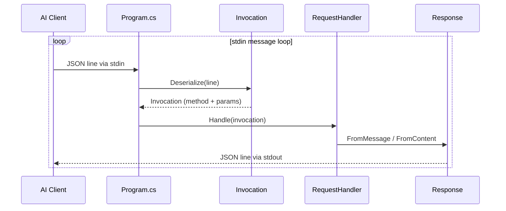
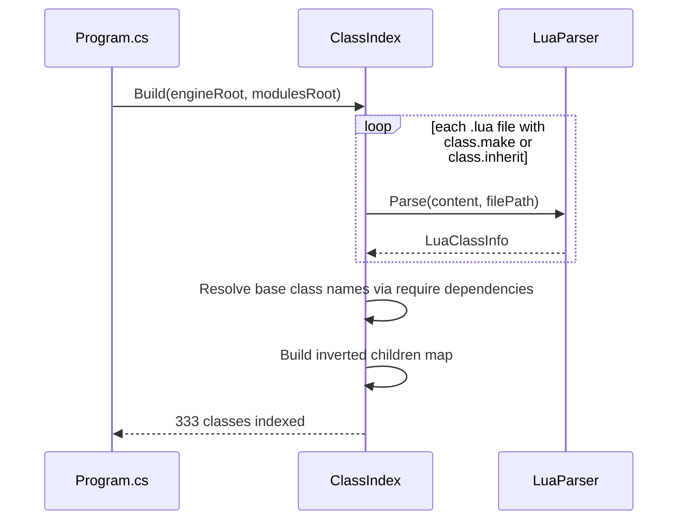

# ToME MCP Server

An [MCP (Model Context Protocol)](https://modelcontextprotocol.io/) server for [Tales of Maj'Eyal](https://te4.org/) that enables AI-assisted addon development and engine exploration.

## What It Does

This server acts as a bridge between an MCP-capable AI assistant (such as Cursor) and the T-Engine4 game engine. It provides tools to:

- **Explore the engine** — Browse and search T-Engine4 source code, understand class hierarchies, and look up API usage patterns
- **Analyze existing addons** — Ingest community and official addons to learn conventions, patterns, and best practices
- **Generate addon code** — Scaffold new addons and write well-structured Lua code that follows ToME conventions
- **Monitor the game** — Watch game logs and output in real-time to verify that addon behavior matches expectations

## Why

Tales of Maj'Eyal runs on T-Engine4, a powerful but sparsely documented Lua-based engine. Learning to write addons means reading source code, reverse-engineering patterns from existing addons, and a lot of trial and error. This MCP server aims to make that process faster and more accessible by giving an AI assistant direct access to the engine internals and a structured way to interact with them.

## Architecture

The server communicates over JSON-RPC via stdio. On startup it scans the full T-Engine4 source tree (engine + game modules), builds an in-memory class index, and then enters a message loop awaiting tool invocations.

### Components

| Component | Description |
|-----------|-------------|
| **MCP Protocol Handler** | JSON-RPC message loop over stdio. Deserializes incoming `Invocation` messages, dispatches to `RequestHandler`, serializes `Response` objects back. |
| **Lua Parser** | Line-oriented structural parser that recognizes T-Engine4's custom OOP patterns (`class.make`, `class.inherit`, `module()`, `_M:method()` definitions, `require` dependencies, LuaDoc comments). |
| **Class Index** | Parses all class-declaring Lua files at startup (~330 classes across engine and modules). Resolves short base class names to fully qualified paths, builds an inverted inheritance map for traversal in both directions. |
| **Request Handler** | Dispatches tool calls to their implementations. Currently handles `ping`, `read_class`, `list_classes`, and `class_hierarchy`. |

### Message Flow



### Startup Indexing



## Available Tools

| Tool | Description | Example |
|------|-------------|---------|
| `ping` | Returns pong (connectivity test) | `{"method": "tools/call", "params": {"name": "ping"}}` |
| `read_class` | Parse a Lua class file and return its structure | `{"method": "tools/call", "params": {"name": "read_class", "class_name": "engine.Actor"}}` |
| `list_classes` | List all indexed classes, optionally filtered | `{"method": "tools/call", "params": {"name": "list_classes", "filter": "Dialog"}}` |
| `class_hierarchy` | Show ancestors and descendants for a class | `{"method": "tools/call", "params": {"name": "class_hierarchy", "class_name": "engine.Entity"}}` |

## Usage

```bash
dotnet run --project src/TomeMcp -- /path/to/TalesMajEyal/game/
```

The single argument is the path to the game's `game/` directory, which contains both `engines/src/` (engine source) and `modules/` (game module source).

## Tech Stack

- **C# / .NET 10** — MCP server implementation
- **Lua** — T-Engine4 addon language (what the server helps you write)
- **MCP** — Communication protocol between the server and AI clients (JSON-RPC over stdio)

## Project Structure

```
tome-mcp/
  src/TomeMcp/
    Program.cs          # Entry point, arg parsing, startup indexing, message loop
    Invocation.cs       # Request deserialization, method/tool registration
    RequestHandler.cs   # Tool dispatch and implementation
    Response.cs         # Response serialization
    LuaParser.cs        # Structural Lua parser for T-Engine4 patterns
    LuaClassInfo.cs     # Data model for parsed class information
    ClassIndex.cs       # In-memory class index with hierarchy traversal
```

## Status

Active development. The MCP protocol handler, Lua parser, and class indexer are functional. Current capabilities:

- Parses T-Engine4's custom OOP system (`class.make`, `class.inherit`, multiple inheritance)
- Indexes 330+ classes across engine and game modules in under 1 second
- Resolves inheritance chains and supports bidirectional hierarchy traversal
- Extracts methods, dependencies, and LuaDoc descriptions from source files

Planned: text search across the codebase, game log monitoring, addon scaffolding and code generation.

## License

[MIT](LICENSE)
